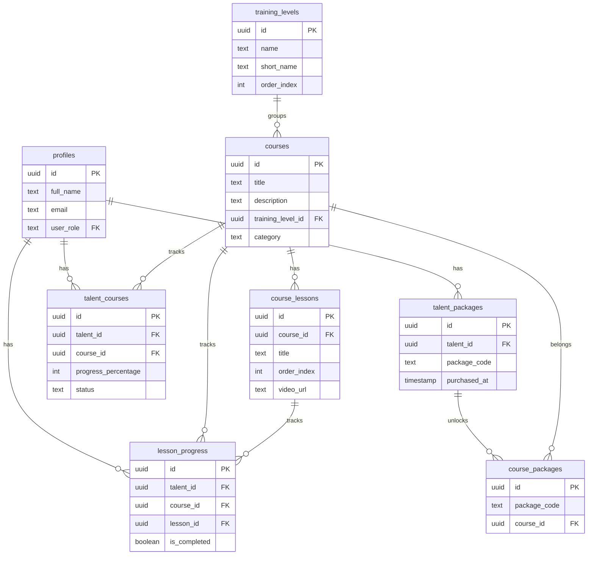

```mermaid
erDiagram
    profiles ||--o{ talent_packages : has
    profiles ||--o{ talent_courses : has
    profiles ||--o{ lesson_progress : has
    
    talent_packages ||--o{ course_packages : unlocks
    
    courses ||--o{ course_lessons : has
    courses ||--o{ talent_courses : tracks
    courses ||--o{ lesson_progress : tracks
    courses ||--o{ course_packages : belongs
    
    training_levels ||--o{ courses : groups
    
    course_lessons ||--o{ lesson_progress : tracks
    
    profiles {
        uuid id PK
        text full_name
        text email
        text user_role FK
    }
    
    training_levels {
        uuid id PK
        text name
        text short_name
        int order_index
    }
    
    courses {
        uuid id PK
        text title
        text description
        uuid training_level_id FK
        text category
    }
    
    course_lessons {
        uuid id PK
        uuid course_id FK
        text title
        int order_index
        text video_url
    }
    
    course_packages {
        uuid id PK
        text package_code
        uuid course_id FK
    }
    
    talent_packages {
        uuid id PK
        uuid talent_id FK
        text package_code
        timestamp purchased_at
    }
    
    talent_courses {
        uuid id PK
        uuid talent_id FK
        uuid course_id FK
        int progress_percentage
        text status
    }
    
    lesson_progress {
        uuid id PK
        uuid talent_id FK
        uuid course_id FK
        uuid lesson_id FK
        boolean is_completed
    }
```
