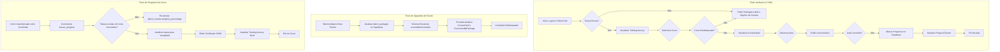

```mermaid
graph TD
    subgraph Fluxo do Aluno na Trilha
        A[Início: Login no Talent Hub] --> B{Possui Pacote?}
        B -- Não --> C[Exibir PackageLocked e Opções de Compra]
        B -- Sim --> D[Visualizar TrainingJourney]
        D --> E{Seleciona Curso}
        E --> F{Curso Desbloqueado?}
        F -- Não --> C
        F -- Sim --> G[Visualizar CourseDetail]
        G --> H{Seleciona Aula}
        H --> I[Exibir LessonViewer]
        I --> J{Aula Concluída?}
        J -- Sim --> K[Marcar Progresso no Supabase]
        K --> L[Atualizar ProgressTracker]
        L --> M[Fim da Aula]
    end

    subgraph Fluxo de Upgrades de Pacote
        N[Talento Adquire Novo Pacote] --> O[Atualizar talent_packages no Supabase]
        O --> P[Sistema Recalcula accessibleCourseIds]
        P --> Q[Frontend Atualiza CourseCard e CourseListByPackage]
        Q --> R[Conteúdo Desbloqueado]
    end

    subgraph Fluxo de Progresso de Curso
        S[Início: Aula Marcada como Concluída] --> T[Incrementar lesson_progress]
        T --> U{Todas as Aulas do Curso Concluídas?}
        U -- Não --> V[Recalcular talent_courses.progress_percentage]
        U -- Sim --> W[Atualizar status para 'completed']
        W --> X[Emitir Certificado JSON]
        X --> Y[Atualizar TrainingJourney Nível]
        Y --> Z[Fim do Curso]
    end
```
